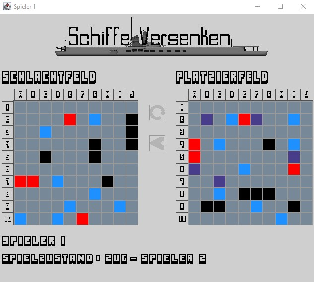

# Multiuser-"Battleship"

Implementation of the classic game "Battleship" for two players in the same network. 

This project was created as part of a scientific propaedeutic seminar in school.

## Table of Contents

- [Overview](#overview)
- [About the Project](#about-the-project)
    - [Built With](#built-with)
- [Getting Started](#getting-started)
    - [Prerequisites](#prerequisites)
    - [Installation](#installation)
- [Usage](#usage)
    - [Two-Users](#two-users)
    - [Single-User](#single-user)
- [Acknowledgements](#acknowledgements)

## Overview

  

Image of the user interface during the battle phase of a game. Here, the left field, the "Schlachtfeld" is where you try to hit your opponents ships, and the right field, the "Platzierfeld", is where you place your ships in the placing phase and see where your enemy is shooting.  
Colors:
- red: a ship is hit, but not completely destroyed
- black: a ship is completely destroyed
- purple: a placed ship that is not yet hit
- light blue: a shot missed

## About the Project 

This project allows two players to play "Battleship" against each other locally, in the same network, on their respective computers.

### Built With

Programming Language: Java  
Note: As part of the seminar, I was given the package "Fenster" which includes JavaFX-like classes to create the user-interface, as well as the packages "Client" and "Server" which form the basic structure of the client-server-architecture.

## Getting Started 

### Prerequisites

A code editor or IDE needs to be installed in order to change the IP-Address and start the application.  
Example: Visual Studio Code

### Installation

1. Download the Project on GitHub
2. Find out your IP-Address:
    - Open terminal/command line
    - enter: **ipconfig**
    - search for the line: **IPv4 Address**
    - note down your IP-Address
3. Open Project in your Code Editor/IDE
4. Adjust the following code section in the class "SVClient":  

```Java
public static void main(String[] args) {
        try {
            new SVClient("YOUR IP-ADDRESS HERE");
        } catch (Exception e) {
            System.err.println("Error: " + e);
        }
}
```  

And the following code section in the class "SVServer":  

```Java
public static void main(String[] args) {
          try {
               new SVServer();
               new SVClient("YOUR IP-ADDRESS HERE");
          } catch (Exception e) {
               System.err.println("Error: " + e);   
          }
}
```

## Usage 

### Two-Users

1. Check that you and your opponent have followed the installation instructions 
2. Open project in code editor/IDE
3. Player One needs to run "SVServer.java"
4. Player Two needs to run "SVClient.java"

### Single-User

1. Check whether you have followed the installation instructions
2. Open project in code editor/IDE
3. Run "SVCreator.java"

## Acknowledgements 

Frank F.: Thank you to Frank F. for allowing the use of the "Fenster", "Client" and "Server" packages.
